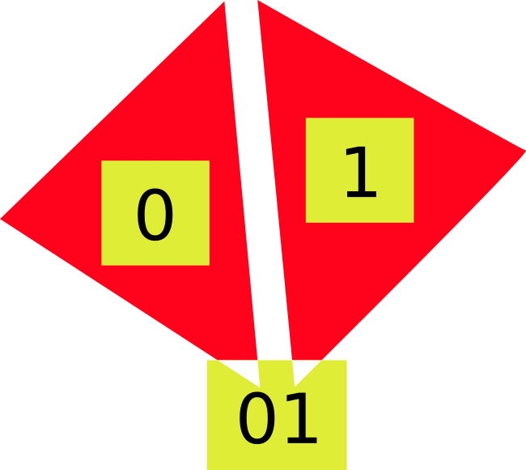

# tag
the abstraction game

## null

### null-textual
[null.tag](./src/null.tag)
```
([defn] |(

[]: [] ::[|>]                           -- null

)>)
```

### null-graphical

`[]: []`


## bool

### bool-textual
[bool.tag](./src/bool.tag)

### bool-graphical

`[0]: []`


`[1]: [1]`


`[01]: < [0] || [1] >`


