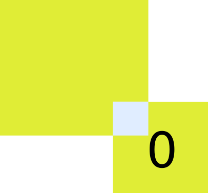
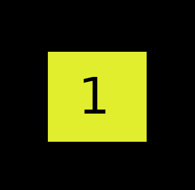

# tag-lang
the abstraction game language
```
######### kinds ###########

- |> triangle (red)
- [] square (yellow)
- () circle (blue)

|> -- outside of the system

[ |> ] -- input

[] -- data

() -- function

(()) -> () -- function composition

([]) -> [] -- function application

(([])) -> ([]) = [] -- the two above

[] -> [] -- type conversion

########### tag0 ############
[] -- nothing
[0]: [] -- false
[1] -- true
[00]: (< []:[1] || _:[0] >) -- =[]?   ( <| --option  |> --other option    ) -- function
[01]: [< [0] || [1] >] -- bool
[10]: (< [0]:[1] || [1]:[0] >) -- =0?
[11]: (< [0]:[0] || [1]:[1] >) -- =1?
[000] -- just 0
[001] -- just 1
[010]: [( | [01] :: [< [] || [< [000] || [001] >] >] > )]  -- maybe
[011]: (< []:[] || (< [([101] |[0000]>)]:[0000] || [([110] |[0000]>)]:[0000] >) >) -- tail
[100]: (< []:[] || (< [([101] |>      )]:[0]    || [([110] |>      )]:[1]    >) >) -- head
[101] -- cons 0
[110] -- cons 1
[111]: [( | [01] :: [< [] || [< ([101] |>) || ([110] |>) >] >] > )] -- list
#############################
```

function ideas: 
```
[0100]: (< []:[] || (< [([101] |>)]:[000] || [([110) |>]:[001] >) >) -- maybeHead
[1111]: (| [(|[0000]>)]:[0000] >) -- id
```
notes: 
```
-- forall a. = [(|[00000]>)] :
-- | = < || >
-- Just a = [000] or [001] -- bool only instance of maybe
```

## Graphics

Tag-lang will be adapted into a graphical esolang. Here are some examples:

`[0]:[]`


`[1]`


